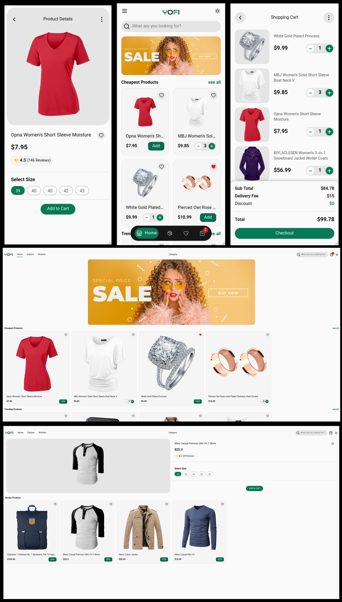

<!-- Logo -->
<p align="center">
  
</p>

<h1 align="center">🛒 Shopping Cart Project</h1>
<p align="center">
  A beautiful, modern shopping cart application built with <b>Vite</b> + <b>React</b> + <b>TypeScript</b>
</p>

<p align="center">
  <!-- Badges -->
  
  
  
  
  
  
  
  
  
  
</p>

---

## 📸 Screenshot

<p align="center">
  
</p>

---

## ✨ Features

- **Modern UI**: Responsive, beautiful design powered by Tailwind CSS.
- **Smooth Animations**: Leveraging GSAP and Framer Motion for delightful interactions.
- **State Management**: React hooks for state and cart logic.
- **Testing**: Robust unit and integration tests with Vitest, React Testing Library, and Jest DOM.
- **Performance**: Vite for lightning-fast development and builds.
- **Type Safety**: Entire codebase in TypeScript.
- **Extensible Architecture**: Easy to add products, payment options, etc.

---

## 🛠️ Technologies Used

- **React** (frontend framework)
- **Vite** (development build tool)
- **TypeScript** (type safety)
- **Tailwind CSS** (utility-first CSS)
- **GSAP** & **Framer Motion** (animation libraries)
- **Vitest** (testing framework)
- **React Testing Library** & **Jest DOM** (component & DOM testing)
- **Sonnet** (utility/tools, please specify more if needed)

---

## 🚀 Getting Started

### Prerequisites

- Node.js (v18+ recommended)
- npm or yarn

### Installation

```bash
# Clone the repo
git clone https://github.com/younesfouladi/shopping-cart.git
cd shopping-cart

# Install dependencies
npm install
# or
yarn install
```

### Run the Project

```bash
# Start development server
npm run dev
# or
yarn dev
```

### Run Tests

```bash
npm run test
# or
yarn test
```

---

## 📂 Project Structure

```
shopping-cart/
├── public/
│   └── images/
│       ├── logo.png
│       └── screenshot.png
├── src/
│   ├── components/
│   ├── hooks/
│   ├── pages/
│   ├── styles/
│   └── ...
├── tests/
├── package.json
└── README.md
```

---

## 🧪 Testing

- All major components are covered with unit and integration tests.
- Uses **Vitest** and **React Testing Library** for test coverage.
- To run all tests:  
  ```bash
  npm run test
  ```

---

## 📈 Contribution

Pull requests are welcome! For major changes, please open an issue first to discuss what you would like to change.

---

## 📄 License

This project is [MIT](LICENSE) licensed.

---

## 💬 Contact

- **Author**: [Younes Fouladi](https://github.com/younesfouladi)
- **Email**: younesfouladi@gmail.com

---

<p align="center">
  <b>Made with ❤️ using Vite + React!</b>
</p>
